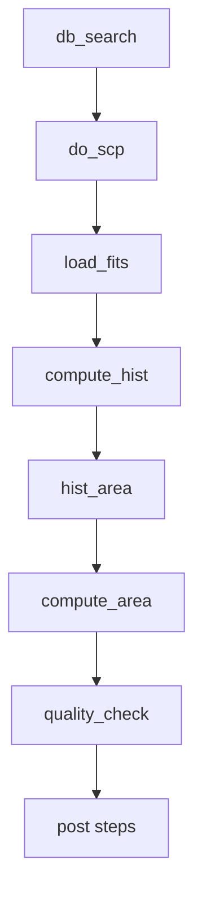

## 1. 目的

## 2. 環境・依存

- 依存  
astropy.io.fits, numpy, sqlite3, subprocess, logging
- パス  
DB_PATH, RAW_DARK_PATH, DARK4LOCATE_DIR, RAID_PC/RAID_DIR, DST_DIR
- パラメータ:  
QUALITY_HIST_RANGE=(55000, 65536), BINS=1000

## 3. 関数定義

### 3.1 関数仕様

>**_load_fits**
>- FITSファイルを開いてヘッダとデータを返す。存在確認と例外処理あり。

>**compute_hist**
>- 引数 (data, bins=BINS, rng=QUALITY_HIST_RANGE)
>- NaN除去後にヒストグラム計算。範囲未指定なら最大最小を使用。

>**hist_area_from_counts**
>- 引数 (hist, bin_edges, log_hist=False)
>- ヒストグラムの面積を計算。log_hist時は対数変換を適用。

>**compute_area**
>- 引数 (data, bins=BINS, rng=QUALITY_HIST_RANGE, log_hist=False)
>- ヒストグラム計算と面積算出をまとめて実行しスコアを返す。

>**db_search**
>- 引数 (conn, object_name, date_label)
>- object_name で frames テーブルを検索し、date_label 毎のベース名リスト辞書を返す。

>**do_scp**
>- 引数 (date_label, Number)
>- RAIDから指定ファイルをDST_DIRへscpコピー。失敗時は例外発生。

>**quality_check**
>- 引数 (fitslist)
>- 各FITSの面積を計算し、エラー判定したファイルを除外して合格リストを返す。

>**classify_AB**
>- 引数 (fitsdict)
>- CDS画像のA/B位置分類を想定した未実装関数。

>**reject_saturation**
>- 引数 なし
>- 飽和除外処理を想定した未実装関数。

>**search_combination_CDS_n_AB**
>- 引数 なし
>- CDS×ABの組合せ探索を想定した未実装関数。

### 3.2 全体フロー（簡易）

### 3.3 注意・TODO
- `db_search` の `object_name` は現状 f-string で埋め込み。**SQLパラメータ化**を推奨（例: `WHERE object LIKE ?`）。
- `date_label` 条件の追加（期間/完全一致/前方一致など）。
- パス定数の**環境変数/引数化**（ハードコード脱却）。
- `quality_check` の閾値ロジック（`area > 0.0` の意味付け）を再検討。
- 例外・ログの粒度調整（FITS 読み込み失敗、ヘッダ検査など）。
- 並列化の検討（I/O バウンド: `concurrent.futures.ThreadPoolExecutor`）。